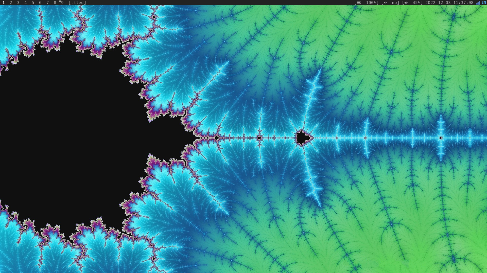
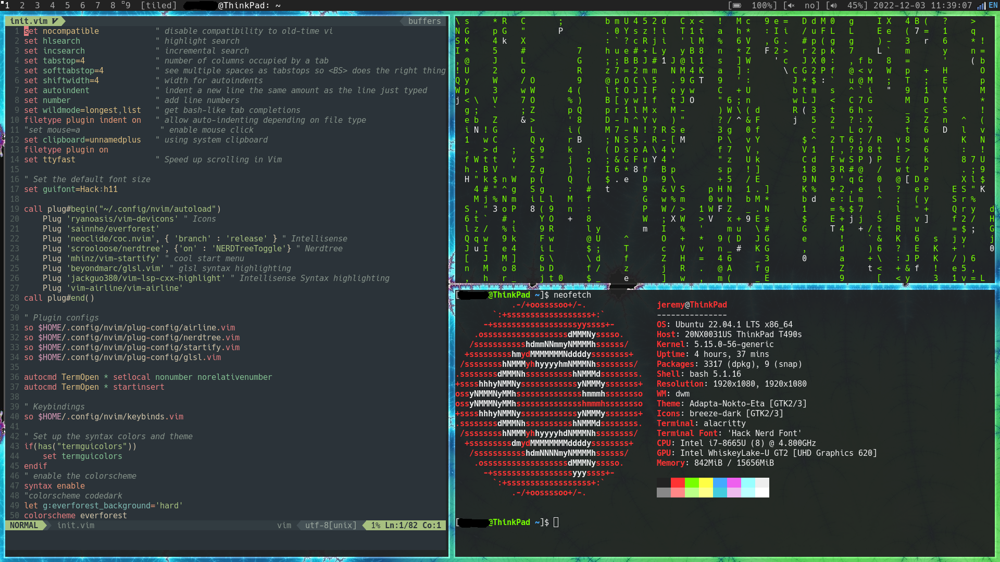
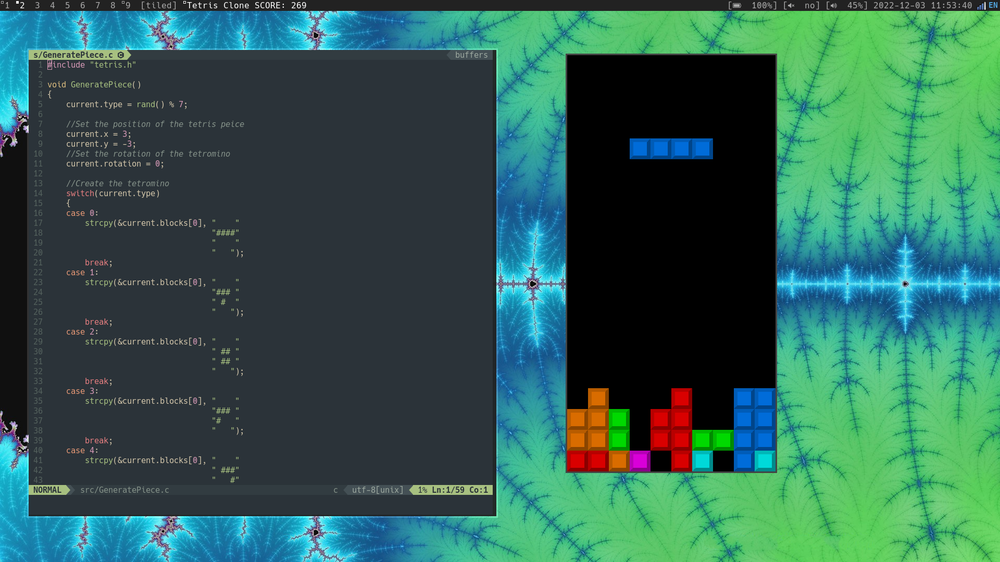

# Suckless Rice
I've used dwm for a while but at the moment of this writing
I'm still not quite sure how I feel about tiling window
managers. However, here is my current riced/patched version
of dwm and some other suckless utilties that I tried to use.

dwm original repo: https://git.suckless.org/dwm

dmenu original repo: https://git.suckless.org/dmenu

slock original repo: https://git.suckless.org/slock

slstatus original repo: https://git.suckless.org/slstatus

I also use KDE on my laptop but I when I have to use the
terminal a lot I like to use dwm.

Patches are included as well.

dwm patches: alwayscenter, autostart, fullgaps, savefloats, systray, winicon
slock patches: slock-message

## Screenshots
### Empty Desktop

### Tiled

### Tetris!

